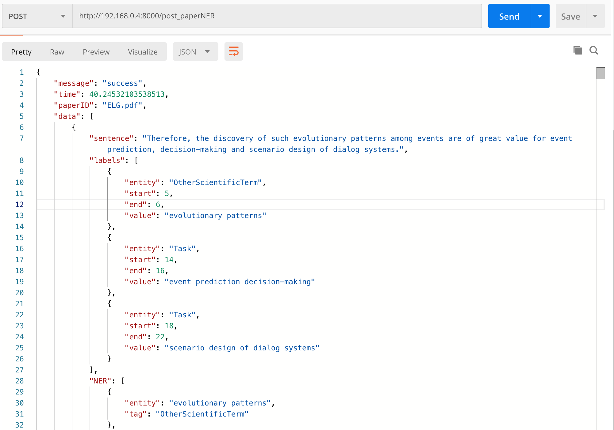

# paperNER


Named Entity Recognition for Paper(PDF)

# Extractor/Algorithm

BERT + BiLSTM + CRF

BERT is based on [SCIBERT](https://github.com/allenai/scibert)

Dataset is [SCIERC](http://nlp.cs.washington.edu/sciIE/) which is taken from 12 AI conference/workshop proceedings in four AI communities, from the Semantic Scholar Corpus.

## Files

- main.py: Users input pdf file path then it will generate NER outputs.
- toolkit
  - pdf_parser: pdf2xml
- save: BERT model for NER(**will be updated soon**)
 
## Requirements (python packages)

- Python 3.6+
- tensorflow<2.0
- [kashgari](https://github.com/BrikerMan/Kashgari)


Versions need to be compatible with each other.

```bash
pip install tensorflow<2.0
pip install kashgari>=1.0.0,<2.0.0
```

## API(optional)
paperNERapi.py

- fastapi
- uvicorn
- pydantic


## Result Preview



```bash
"C:\Program Files\Python36\python.exe" C:/Users/xy644/Desktop/scibert-project/paperNER/main.py
input file path: ELG.pdf
--------------------------------
text: In order to discover the evolutionary patterns and logics of events, we propose an eventcentric knowledge graph — Event Logic Graph (ELG) and the framework to construct ELG.
labels [{'entity': 'OtherScientificTerm', 'start': 5, 'end': 6, 'value': 'evolutionary patterns'}, {'entity': 'OtherScientificTerm', 'start': 8, 'end': 8, 'value': 'logics'}, {'entity': 'OtherScientificTerm', 'start': 10, 'end': 10, 'value': 'events,'}, {'entity': 'Method', 'start': 14, 'end': 16, 'value': 'eventcentric knowledge graph'}, {'entity': 'Method', 'start': 18, 'end': 18, 'value': 'Event'}]
	value: evolutionary patterns 	 OtherScientificTerm
	value: logics 	 OtherScientificTerm
	value: events, 	 OtherScientificTerm
	value: eventcentric knowledge graph 	 Method
	value: Event 	 Method
--------------------------------
text: ELG is a directed cyclic graph, whose nodes are events, and edges stand for the sequential (the same meaning with “temporal”), causal, conditional or hypernym-hyponym (“is-a”) relations between events.
labels [{'entity': 'OtherScientificTerm', 'start': 3, 'end': 3, 'value': 'directed'}, {'entity': 'Method', 'start': 4, 'end': 5, 'value': 'cyclic graph,'}, {'entity': 'OtherScientificTerm', 'start': 7, 'end': 7, 'value': 'nodes'}, {'entity': 'OtherScientificTerm', 'start': 9, 'end': 9, 'value': 'events,'}, {'entity': 'OtherScientificTerm', 'start': 15, 'end': 15, 'value': 'sequential'}]
	value: directed 	 OtherScientificTerm
	value: cyclic graph, 	 Method
	value: nodes 	 OtherScientificTerm
	value: events, 	 OtherScientificTerm
	value: sequential 	 OtherScientificTerm
--------------------------------
text: Essentially, ELG is an event logic knowledge base, which can reveal evolutionary patterns and development logics of real world events.
labels [{'entity': 'Method', 'start': 1, 'end': 1, 'value': 'ELG'}, {'entity': 'Method', 'start': 4, 'end': 7, 'value': 'event logic knowledge base,'}, {'entity': 'OtherScientificTerm', 'start': 11, 'end': 12, 'value': 'evolutionary patterns'}, {'entity': 'OtherScientificTerm', 'start': 14, 'end': 15, 'value': 'development logics'}]
	value: ELG 	 Method
	value: event logic knowledge base, 	 Method
	value: evolutionary patterns 	 OtherScientificTerm
	value: development logics 	 OtherScientificTerm
--------------------------------
text: Third, experimental results show that ELG is capable of improving the performances of downstream applications, such as script event prediction.
labels [{'entity': 'Method', 'start': 5, 'end': 5, 'value': 'ELG'}, {'entity': 'Task', 'start': 13, 'end': 13, 'value': 'downstream'}, {'entity': 'Generic', 'start': 14, 'end': 14, 'value': 'applications,'}, {'entity': 'OtherScientificTerm', 'start': 17, 'end': 18, 'value': 'script event'}]
	value: ELG 	 Method
	value: downstream 	 Task
	value: applications, 	 Generic
	value: script event 	 OtherScientificTerm
--------------------------------
text: ELG is a directed cyclic graph, whose nodes are events, and edges stand for the sequential, causal, conditional or hypernym-hyponym relations between events.
labels [{'entity': 'OtherScientificTerm', 'start': 3, 'end': 5, 'value': 'directed cyclic graph,'}, {'entity': 'OtherScientificTerm', 'start': 7, 'end': 7, 'value': 'nodes'}, {'entity': 'OtherScientificTerm', 'start': 9, 'end': 9, 'value': 'events,'}, {'entity': 'OtherScientificTerm', 'start': 15, 'end': 18, 'value': 'sequential, causal, conditional or'}]
	value: directed cyclic graph, 	 OtherScientificTerm
	value: nodes 	 OtherScientificTerm
	value: events, 	 OtherScientificTerm
	value: sequential, causal, conditional or 	 OtherScientificTerm
--------------------------------
text: In general, events and the degree of abstraction of an event are closely related to the scene in which the event occurred, and a single event may become too abstract to understand without the context scenario.
labels [{'entity': 'Task', 'start': 1, 'end': 1, 'value': 'general,'}, {'entity': 'OtherScientificTerm', 'start': 2, 'end': 2, 'value': 'events'}, {'entity': 'OtherScientificTerm', 'start': 7, 'end': 7, 'value': 'abstraction'}, {'entity': 'OtherScientificTerm', 'start': 10, 'end': 10, 'value': 'event'}]
	value: general, 	 Task
	value: events 	 OtherScientificTerm
	value: abstraction 	 OtherScientificTerm
	value: event 	 OtherScientificTerm
--------------------------------
text: While (go, somewhere), (do, the things) and (eat) are unreasonable or incomplete event representations, as their semantics are too vague to be understood.
labels [{'entity': 'Method', 'start': 1, 'end': 2, 'value': '(go, somewhere),'}, {'entity': 'Method', 'start': 5, 'end': 5, 'value': 'things)'}, {'entity': 'OtherScientificTerm', 'start': 6, 'end': 7, 'value': 'and (eat)'}, {'entity': 'OtherScientificTerm', 'start': 9, 'end': 12, 'value': 'unreasonable or incomplete event'}, {'entity': 'OtherScientificTerm', 'start': 16, 'end': 16, 'value': 'semantics'}]
	value: (go, somewhere), 	 Method
	value: things) 	 Method
	value: and (eat) 	 OtherScientificTerm
	value: unreasonable or incomplete event 	 OtherScientificTerm
	value: semantics 	 OtherScientificTerm
--------------------------------
text: ” (have, lunch), (pay, the bill) and (leave the restaurant) compose a sequential event chain.
labels [{'entity': 'OtherScientificTerm', 'start': 5, 'end': 5, 'value': 'bill)'}, {'entity': 'OtherScientificTerm', 'start': 9, 'end': 9, 'value': 'restaurant)'}, {'entity': 'OtherScientificTerm', 'start': 12, 'end': 13, 'value': 'sequential event'}]
	value: bill) 	 OtherScientificTerm
	value: restaurant) 	 OtherScientificTerm
	value: sequential event 	 OtherScientificTerm
--------------------------------
text: binations between frequency-based features may provide extra information that is useful for sequential relation and direction classification, shown in Table 2 (R1 to R11).
labels [{'entity': 'OtherScientificTerm', 'start': 0, 'end': 0, 'value': 'binations'}, {'entity': 'OtherScientificTerm', 'start': 2, 'end': 3, 'value': 'frequency-based features'}, {'entity': 'OtherScientificTerm', 'start': 12, 'end': 13, 'value': 'sequential relation'}, {'entity': 'OtherScientificTerm', 'start': 15, 'end': 16, 'value': 'direction classification,'}]
	value: binations 	 OtherScientificTerm
	value: frequency-based features 	 OtherScientificTerm
	value: sequential relation 	 OtherScientificTerm
	value: direction classification, 	 OtherScientificTerm
--------------------------------
input file path: 
```
